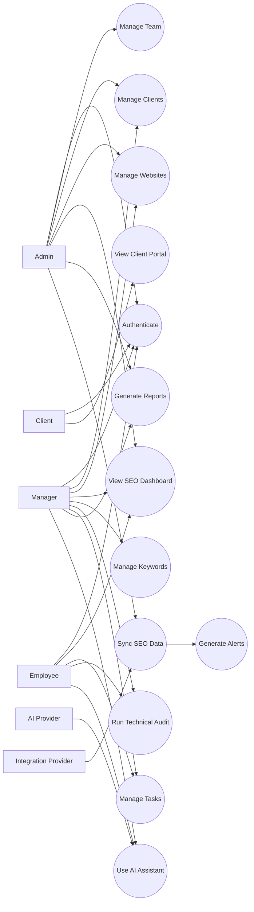
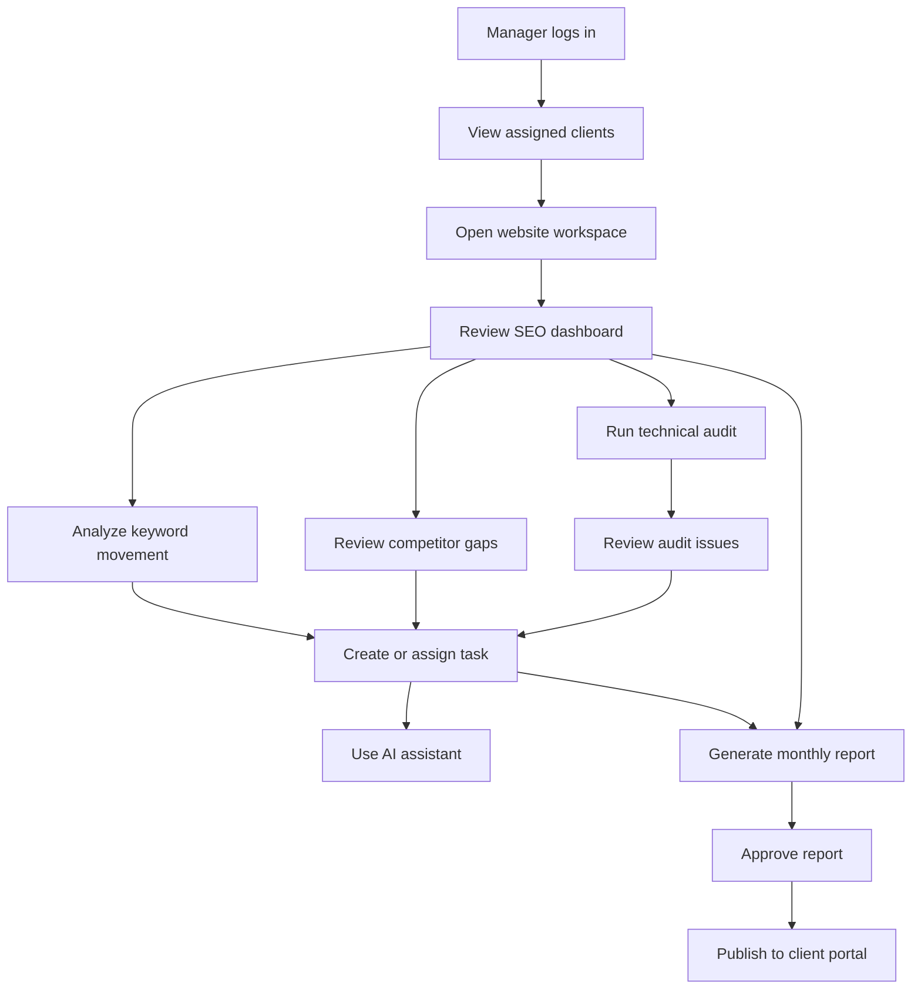
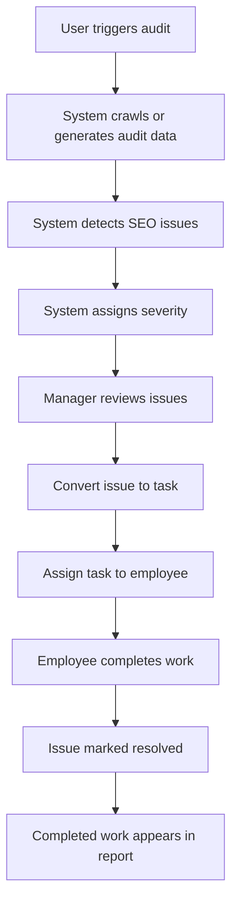
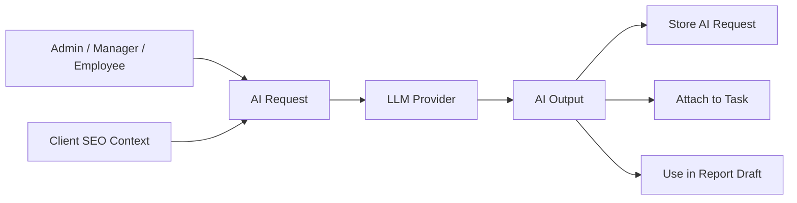
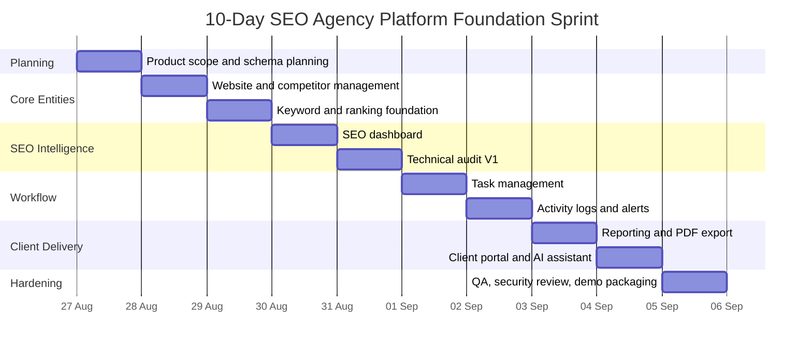
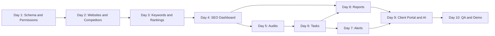

# SEO Agency Platform: Features, Use Cases, Diagrams, and 10-Day Timeline

## 1. Project Scope

This document defines the first 10-day implementation scope for a company-level SEO agency platform.

The 10-day target is not a complete enterprise product. It is a foundation sprint that should produce a working, demo-ready core system with the main product loop:

**Client -> Website -> SEO Data -> Insight -> Task -> Report -> Client Portal**

## 2. Core Features

## 2.1 User, Role, and Access Management

- Agency workspace.
- User login and signup.
- JWT authentication.
- Role-based access control.
- Roles: Admin, Manager, Employee, Client.
- Client assignment rules.
- Protected frontend routes.
- Tenant isolation by agency and client.
- Client-safe API responses.

## 2.2 Client Management

- Add, edit, view, and delete clients.
- Store client company profile.
- Store client contacts.
- Add internal notes.
- Track client status: active, paused, churned.
- Store retainer data for internal users only.
- Assign managers and employees to clients.
- View client activity history.

## 2.3 Website Management

- Add, edit, view, and delete websites.
- Link websites to clients.
- Store domain, status, SEO score, last audit date, CMS, target locations, and business category.
- Add competitors for each website.
- Website detail page with SEO tabs.

## 2.4 SEO Dashboard

- SEO score overview.
- Organic traffic trend.
- Clicks, impressions, CTR, and average position.
- Keyword movement summary.
- Top ranking keywords.
- Ranking distribution.
- Audit issue summary.
- Backlink summary.
- Task summary.
- Mock/live data indicator.
- Client-safe dashboard version.

## 2.5 Keyword Management

- Add and edit keywords.
- Group keywords.
- Store search volume, difficulty, CPC, intent, target page, device, location, and language.
- Track ranking history.
- Show improved, declined, unchanged, top 3, top 10, and top 100 keywords.
- CSV import/export.
- Keyword opportunity score.

## 2.6 Competitor Intelligence

- Add competitors per website.
- Compare client keywords against competitors.
- Identify missing keywords.
- Identify shared keywords.
- Show competitor top pages.
- Show competitor visibility score.
- Basic share-of-voice calculation using mock/provider data.

## 2.7 Technical SEO Audit

- Trigger a website audit.
- Store audit runs.
- Generate issue list.
- Detect basic technical SEO issues:
  - Broken links.
  - Missing title.
  - Duplicate title.
  - Missing meta description.
  - Duplicate meta description.
  - Missing H1.
  - Multiple H1 tags.
  - Image alt text issues.
  - Noindex pages.
  - Redirect chains.
  - Canonical issues.
  - Sitemap gaps.
  - Robots.txt blocks.
  - Slow pages.
- Assign severity: critical, high, medium, low.
- Mark issues as resolved.
- Convert audit issue into task.

## 2.8 Task and Workflow Management

- Create, edit, view, and delete tasks.
- Assign tasks to users.
- Link tasks to clients, websites, keywords, audit issues, or reports.
- Set category, priority, status, and deadline.
- Add comments.
- Add attachment metadata.
- View task history.
- Employee "My Tasks" dashboard.
- Manager workload view.

## 2.9 Reporting and Client Portal

- Generate monthly SEO report.
- Report sections:
  - Executive summary.
  - Traffic performance.
  - Keyword wins and losses.
  - Technical issues fixed.
  - Open technical issues.
  - Completed tasks.
  - Content work.
  - Backlink summary.
  - Next-month plan.
- PDF export.
- Report approval flow.
- Client portal report view.
- Client dashboard with restricted fields.

## 2.10 AI Assistant

- Ranking drop explanation.
- Keyword suggestions.
- Content brief generation.
- Performance summary.
- Audit issue summary.
- Issue-to-task draft creation.
- Store AI request history.
- Apply rate limiting on AI endpoints.

## 2.11 Alerts and Notifications

- Task assigned notification.
- Deadline approaching notification.
- Ranking drop alert.
- Traffic drop alert.
- Critical audit issue alert.
- Report ready alert.
- Integration sync failure alert.

## 2.12 Integrations Foundation

- Mock integration provider for development.
- Adapter interface for real integrations.
- Future integration targets:
  - Google Search Console.
  - Google Analytics 4.
  - PageSpeed Insights.
  - Google Business Profile.
  - Semrush.
  - Ahrefs.

## 3. Primary Actors

| Actor | Description |
|---|---|
| Admin | Agency owner or administrator with full access. |
| Manager | SEO manager responsible for assigned clients and reports. |
| Employee | SEO specialist responsible for assigned execution tasks. |
| Client | External client with restricted portal access. |
| Integration Provider | External data source such as GSC, GA4, Semrush, Ahrefs, or PageSpeed. |
| AI Provider | LLM provider used for summaries, briefs, and recommendations. |

## 4. Use Cases

## 4.1 Admin Use Cases

- Sign up and create agency workspace.
- Invite users.
- Assign roles.
- Add clients.
- Add client contacts.
- Add websites.
- Assign team members to clients.
- View all agency KPIs.
- Manage integrations.
- Review all reports.
- Configure white-label branding.

## 4.2 Manager Use Cases

- View assigned clients.
- View website SEO dashboard.
- Add or update keywords.
- Review ranking movement.
- Run website audit.
- Convert audit issue into task.
- Assign tasks to employees.
- Review team workload.
- Generate monthly report.
- Approve report for client.
- Use AI assistant for strategy support.

## 4.3 Employee Use Cases

- View assigned tasks.
- Open task detail.
- Review client and website context.
- Add task comments.
- Upload task attachment metadata.
- Update task status.
- Use AI assistant to create briefs or summaries.
- Mark task complete.

## 4.4 Client Use Cases

- Log in to client portal.
- View client-safe SEO dashboard.
- View completed work.
- View current priorities.
- Download approved reports.
- View recommendations.

## 4.5 System Use Cases

- Sync SEO data from mock/live providers.
- Generate keyword ranking history.
- Run technical audit.
- Generate alerts.
- Generate PDF report.
- Store activity logs.
- Enforce tenant isolation.

## 5. Use Case Diagram: Overall System

## 6. Use Case Diagram: SEO Manager Workflow

## 7. Use Case Diagram: Client Portal

## 8. Use Case Diagram: Audit-to-Task Flow

## 9. Use Case Diagram: AI Assistant

## 10. 10-Day Schedule and Timeline

## Day 1: Product Finalization and Database Planning

**Focus:** Confirm the company-level architecture and prepare implementation.

- Finalize MVP boundaries.
- Finalize user roles and permissions.
- Review existing schema.
- Add missing database tables for websites, competitors, rank tracking, audits, alerts, reports, and AI history.
- Define tenant-isolation rules.
- Define API route groups.

**Output:** Updated technical plan, schema changes, and permission matrix.

## Day 2: Website and Competitor Management

**Focus:** Make websites the center of SEO work.

- Build website CRUD backend.
- Build website CRUD frontend.
- Add website detail page.
- Add competitor model and endpoints.
- Add competitor UI.
- Add seed data.

**Output:** Users can manage client websites and competitors.

## Day 3: Keyword Management and Ranking History

**Focus:** Build keyword tracking foundation.

- Build keyword CRUD.
- Build keyword groups.
- Add ranking history table.
- Add mock ranking generator.
- Add keyword table UI.
- Add ranking trend chart.
- Add keyword filters.

**Output:** Users can track keywords and ranking movement.

## Day 4: SEO Dashboard

**Focus:** Build the core performance dashboard.

- Build SEO summary endpoint.
- Build traffic trend endpoint.
- Add KPI cards.
- Add traffic chart.
- Add ranking distribution chart.
- Add keyword movement summary.
- Add mock/live data labels.
- Add client-safe dashboard response.

**Output:** Internal users and clients can view SEO performance.

## Day 5: Technical SEO Audit V1

**Focus:** Build basic audit workflow.

- Add audit run model.
- Add audit issue model.
- Add audit trigger endpoint.
- Generate mock/rule-based technical issues.
- Add issue severity.
- Build audit list UI.
- Build issue list UI.
- Add mark-resolved action.

**Output:** Users can run audits and review technical issues.

## Day 6: Task Management

**Focus:** Connect SEO findings to work execution.

- Build task CRUD.
- Add task comments.
- Add attachment metadata.
- Add assignment flow.
- Add task status updates.
- Add task filters.
- Add employee "My Tasks" view.
- Add issue-to-task conversion.

**Output:** SEO issues and opportunities can become assigned work.

## Day 7: Activity Logs, Alerts, and Notifications

**Focus:** Add operational visibility.

- Add activity logging.
- Add notification model.
- Add task assigned notification.
- Add deadline notification.
- Add critical audit issue alert.
- Add ranking drop alert using mock ranking data.
- Add notification bell UI.

**Output:** Users can see important changes and pending actions.

## Day 8: Reporting and PDF Export

**Focus:** Create manager-reviewed client reports.

- Add report model.
- Add report generation endpoint.
- Aggregate SEO dashboard, keywords, audit issues, tasks, and recommendations.
- Build report preview UI.
- Add report approval status.
- Add PDF export.

**Output:** Managers can generate and approve monthly SEO reports.

## Day 9: Client Portal and AI Assistant

**Focus:** Add client-facing access and AI support.

- Build client portal dashboard.
- Build approved reports page.
- Ensure client-safe API responses.
- Add AI provider abstraction.
- Add ranking explanation prompt.
- Add content brief prompt.
- Add performance summary prompt.
- Store AI request history.

**Output:** Clients can view approved progress, and internal users can use AI support.

## Day 10: QA, Security Review, and Demo Packaging

**Focus:** Stabilize the sprint output.

- Add tenant-isolation tests.
- Add RBAC tests.
- Test client portal data restrictions.
- Test critical user flows.
- Fix UI loading, empty, and error states.
- Prepare demo seed data.
- Prepare deployment checklist.
- Document known limitations and next-phase work.

**Output:** Demo-ready foundation with tested core workflow.

## 11. Timeline Diagram

## 12. Dependency Timeline

## 13. Expected End-of-Sprint Demo

At the end of 10 days, the demo should show:

1. Admin logs in.
2. Admin opens a client.
3. Admin adds a website and competitors.
4. Manager opens the website SEO dashboard.
5. Manager reviews keywords and ranking movement.
6. Manager runs a technical audit.
7. Manager converts an issue into a task.
8. Employee opens the task, comments, and marks it complete.
9. Manager generates a monthly report.
10. Client logs in and views the approved report and client-safe dashboard.

## 14. Out of Scope for the First 10 Days

- Full live Semrush/Ahrefs integration.
- Full production crawler at Screaming Frog scale.
- Billing/subscription system.
- CRM/sales pipeline.
- Advanced white-label custom domains.
- Fully automated AI agents.
- Real-time rank tracking at scale.
- Large-scale backlink index.

These should be planned after the foundation sprint.

