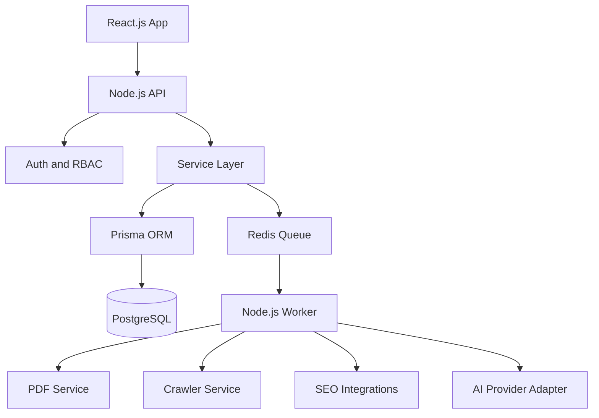
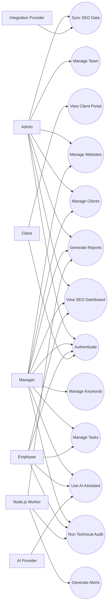
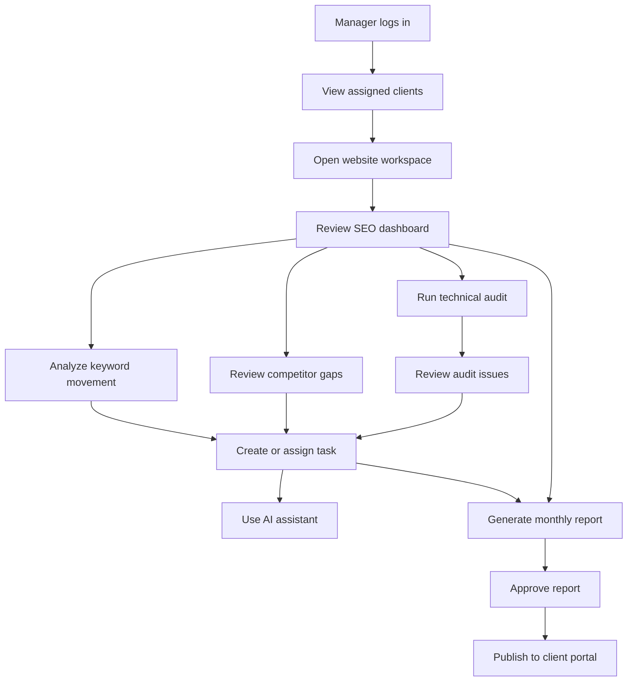
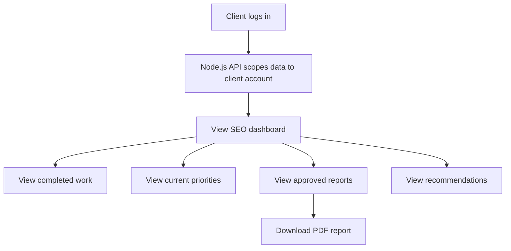
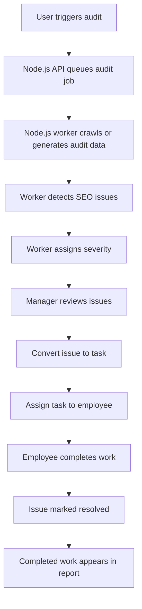
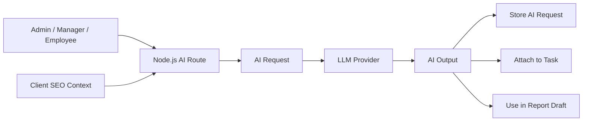
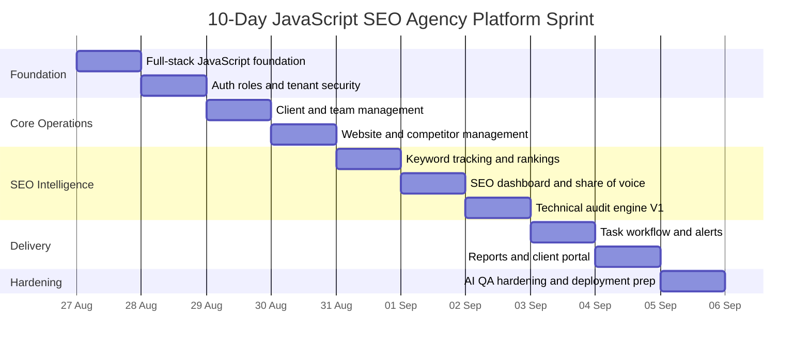

# SEO Agency Platform: JavaScript-Only Features, Use Cases, and 10-Day Timeline

## 1. Project Scope

This document defines a 10-day company-level foundation plan for an SEO agency platform built completely in JavaScript.

The product must use JavaScript across the full stack:

- Frontend: React.js.
- Backend/API: Node.js with Express.js or NestJS.
- Database access: Prisma or Sequelize from Node.js.
- Jobs/workers: Node.js worker process with BullMQ or a similar JS queue.
- PDF generation: Node.js with Playwright/Puppeteer.
- Crawling/audits: Node.js crawler services.
- AI/integrations: Node.js adapter services.

This is not a throwaway demo plan. The 10-day target is a company-level MVP foundation that can grow into production. The first release must prove the full operating loop:

**Client -> Website -> SEO Data -> Insight -> Task -> Report -> Client Portal**

## 2. Company-Level Architecture

## 2.1 Stack

| Layer | Technology |
|---|---|
| Frontend | React.js, Vite, React Router, React Query |
| Styling | Tailwind CSS or structured CSS modules |
| Charts | Recharts |
| Backend | Node.js API using Express.js or NestJS |
| Database | PostgreSQL |
| ORM | Prisma recommended |
| Auth | JWT access token plus secure refresh token |
| Jobs | Node.js worker plus BullMQ/Redis |
| PDF | Playwright or Puppeteer from Node.js |
| Crawling | Node.js crawler service |
| AI | Node.js LLM adapter layer |
| Integrations | Node.js provider adapters for GSC, GA4, PageSpeed, Semrush, Ahrefs later |
| Testing | Vitest/Jest, React Testing Library, Supertest, Playwright |
| Deployment | Node.js hosting, PostgreSQL, Redis, object storage |

## 2.2 Architecture Diagram

## 3. Core Features

## 3.1 User, Role, and Access Management

- Agency workspace.
- User login and signup.
- JWT authentication.
- Refresh-token handling.
- Role-based access control.
- Roles: Admin, Manager, Employee, Client.
- Client assignment rules.
- Protected React routes.
- Backend route guards in Node.js.
- Tenant isolation by agency and client.
- Client-safe response serializers.

## 3.2 Client Management

- Add, edit, view, and delete clients.
- Store client company profile.
- Store client contacts.
- Add internal notes.
- Track client status: active, paused, churned.
- Store retainer data for internal users only.
- Assign managers and employees to clients.
- View client activity history.
- Client health score foundation.

## 3.3 Website Management

- Add, edit, view, and delete websites.
- Link websites to clients.
- Store domain, status, SEO score, CMS, target locations, business category, preferred locale, and search engine target.
- Add competitors for each website.
- Website workspace with tabs: Overview, Keywords, Audits, Competitors, Backlinks, Content, Tasks, Reports.

## 3.4 SEO Dashboard

- SEO score overview.
- Organic traffic trend.
- Clicks, impressions, CTR, and average position.
- Keyword movement summary.
- Top ranking keywords.
- Ranking distribution.
- Audit issue summary.
- Backlink summary.
- Task summary.
- Mock/live data indicator.
- Client-safe dashboard version.

## 3.5 Keyword Management

- Add and edit keywords.
- Group keywords.
- Store search volume, difficulty, CPC, intent, target page, device, location, and language.
- Track ranking history.
- Show improved, declined, unchanged, top 3, top 10, and top 100 keywords.
- CSV import/export.
- Keyword opportunity score.
- Future keyword gap against competitors.

## 3.6 Competitor Intelligence

- Add competitors per website.
- Compare client keywords against competitors.
- Identify missing keywords.
- Identify shared keywords.
- Show competitor top pages.
- Show competitor visibility score.
- Basic share-of-voice calculation.

## 3.7 Technical SEO Audit

- Trigger website audit from React UI.
- Queue audit job in Node.js worker.
- Store audit runs.
- Store crawled URL data.
- Generate issue list.
- Detect basic technical SEO issues:
  - Broken links.
  - Missing title.
  - Duplicate title.
  - Missing meta description.
  - Duplicate meta description.
  - Missing H1.
  - Multiple H1 tags.
  - Image alt text issues.
  - Noindex pages.
  - Redirect chains.
  - Canonical issues.
  - Sitemap gaps.
  - Robots.txt blocks.
  - Slow pages.
- Assign severity: critical, high, medium, low.
- Mark issues as resolved.
- Convert audit issue into task.

## 3.8 Task and Workflow Management

- Create, edit, view, and delete tasks.
- Assign tasks to users.
- Link tasks to clients, websites, keywords, audit issues, or reports.
- Set category, priority, status, and deadline.
- Add comments.
- Add attachment metadata.
- View task history.
- Employee My Tasks dashboard.
- Manager workload view.
- Activity logs.

## 3.9 Reporting and Client Portal

- Generate monthly SEO reports.
- Report sections:
  - Executive summary.
  - Traffic performance.
  - Keyword wins and losses.
  - Technical issues fixed.
  - Open technical issues.
  - Completed tasks.
  - Content work.
  - Backlink summary.
  - Next-month plan.
- PDF export using Node.js Playwright/Puppeteer.
- Report approval flow.
- Client portal report view.
- Client dashboard with restricted fields.

## 3.10 AI Assistant

- Ranking drop explanation.
- Keyword suggestions.
- Content brief generation.
- Performance summary.
- Audit issue summary.
- Issue-to-task draft creation.
- Store AI request history.
- Apply rate limiting on AI endpoints.
- Keep AI output internal until approved.

## 3.11 Alerts and Notifications

- Task assigned notification.
- Deadline approaching notification.
- Ranking drop alert.
- Traffic drop alert.
- Critical audit issue alert.
- Report ready alert.
- Integration sync failure alert.

## 3.12 Integrations Foundation

- Mock integration provider for development.
- JavaScript adapter interface for real integrations.
- Future integration targets:
  - Google Search Console.
  - Google Analytics 4.
  - PageSpeed Insights.
  - Google Business Profile.
  - Semrush.
  - Ahrefs.

## 4. Primary Actors

| Actor | Description |
|---|---|
| Admin | Agency owner or administrator with full access. |
| Manager | SEO manager responsible for assigned clients and reports. |
| Employee | SEO specialist responsible for assigned execution tasks. |
| Client | External client with restricted portal access. |
| Node.js Worker | Background process for crawls, reports, alerts, syncs, and AI jobs. |
| Integration Provider | External data source such as GSC, GA4, Semrush, Ahrefs, or PageSpeed. |
| AI Provider | LLM provider used for summaries, briefs, and recommendations. |

## 5. Use Cases

## 5.1 Admin Use Cases

- Sign up and create agency workspace.
- Invite users.
- Assign roles.
- Add clients.
- Add client contacts.
- Add websites.
- Assign team members to clients.
- View all agency KPIs.
- Manage integrations.
- Review all reports.
- Configure white-label branding.

## 5.2 Manager Use Cases

- View assigned clients.
- View website SEO dashboard.
- Add or update keywords.
- Review ranking movement.
- Run website audit.
- Convert audit issue into task.
- Assign tasks to employees.
- Review team workload.
- Generate monthly report.
- Approve report for client.
- Use AI assistant for strategy support.

## 5.3 Employee Use Cases

- View assigned tasks.
- Open task detail.
- Review client and website context.
- Add task comments.
- Upload task attachment metadata.
- Update task status.
- Use AI assistant to create briefs or summaries.
- Mark task complete.

## 5.4 Client Use Cases

- Log in to client portal.
- View client-safe SEO dashboard.
- View completed work.
- View current priorities.
- Download approved reports.
- View recommendations.

## 5.5 System Use Cases

- Sync SEO data from mock/live providers.
- Generate keyword ranking history.
- Run technical audit in Node.js worker.
- Generate alerts.
- Generate PDF report from Node.js.
- Store activity logs.
- Enforce tenant isolation in backend route guards and service layer.

## 6. Use Case Diagram: Overall System

## 7. Use Case Diagram: SEO Manager Workflow

## 8. Use Case Diagram: Client Portal

## 9. Use Case Diagram: Audit-to-Task Flow

## 10. Use Case Diagram: AI Assistant

## 11. 10-Day Company-Level JavaScript Timeline

## Day 1: JavaScript Project Foundation

**Focus:** Establish the full-stack JavaScript architecture.

- Set up React.js app with Vite.
- Set up Node.js backend API project.
- Set up shared JavaScript config and environment handling.
- Set up PostgreSQL connection through Prisma.
- Define Prisma schema for agencies, users, roles, clients, websites, competitors, keywords, audits, tasks, reports, alerts, integrations, and AI requests.
- Define RBAC permissions in JavaScript.
- Define tenant scoping helpers.
- Define client-safe serializers.
- Add lint/build/test scripts.

**Output:** Full-stack JavaScript foundation ready for feature implementation.

## Day 2: Auth, Roles, and Tenant Security

**Focus:** Build secure access control first.

- Implement signup and login in Node.js.
- Hash passwords with a Node.js library.
- Issue JWT access tokens.
- Add refresh-token flow.
- Add Admin, Manager, Employee, and Client roles.
- Add backend route guards.
- Add protected React routes.
- Add tenant-isolation tests.

**Output:** Users can authenticate and access only allowed data.

## Day 3: Client and Team Management

**Focus:** Build agency operating foundation.

- Build client CRUD API.
- Build client list/detail UI.
- Build contacts and internal notes.
- Add team user management.
- Assign managers and employees to clients.
- Add activity log entries.
- Hide retainer/internal fields from client role.

**Output:** Agency users can manage clients and team assignments safely.

## Day 4: Website and Competitor Management

**Focus:** Make websites the center of SEO work.

- Build website CRUD API and UI.
- Store CMS, business category, locations, locale, and search engines.
- Build website workspace tabs.
- Add competitor CRUD API and UI.
- Add seed/demo data through JS seed script.

**Output:** Each client can have websites, competitors, and project-level SEO settings.

## Day 5: Keyword Tracking and Ranking History

**Focus:** Build keyword intelligence foundation.

- Build keyword CRUD API and UI.
- Build keyword groups.
- Add ranking history model.
- Add mock ranking generator in Node.js.
- Add keyword table filters.
- Add ranking trend charts.
- Add import/export foundation.

**Output:** Users can track keywords and ranking movement.

## Day 6: SEO Dashboard and Share of Voice

**Focus:** Build the main performance dashboard.

- Build SEO summary API.
- Add traffic trend API.
- Add KPI cards in React.
- Add ranking distribution chart.
- Add keyword movement chart.
- Add top pages section.
- Add competitor visibility/share-of-voice calculation.
- Add mock/live labels.
- Add client-safe dashboard response.

**Output:** Internal users and clients can view scoped SEO performance.

## Day 7: Technical Audit Engine V1

**Focus:** Build Node.js crawl/audit foundation.

- Add audit run model.
- Add crawled URL model.
- Add technical issue model.
- Create Node.js audit worker.
- Generate rule-based technical issues.
- Add issue severity scoring.
- Build audit UI.
- Add mark-resolved action.
- Add issue-to-task conversion.

**Output:** Users can run audits, inspect issues, and convert issues into work.

## Day 8: Task Workflow and Alerts

**Focus:** Connect SEO insights to execution.

- Build task CRUD API and UI.
- Add comments and attachment metadata.
- Add assignment flow.
- Add status transitions.
- Add My Tasks view.
- Add manager workload view.
- Add notifications and alerts.
- Add activity logging.

**Output:** SEO findings can become assigned and trackable work.

## Day 9: Reports and Client Portal

**Focus:** Package work into client-facing outcomes.

- Build report model and API.
- Aggregate traffic, keyword, audit, task, and recommendation data.
- Build report preview UI.
- Generate PDF with Node.js Playwright/Puppeteer.
- Add approval workflow.
- Build client portal dashboard.
- Build approved reports page.

**Output:** Clients can view approved progress and download reports.

## Day 10: AI, QA, Hardening, and Deployment Prep

**Focus:** Make the MVP foundation credible for company use.

- Add Node.js AI provider abstraction.
- Add prompts for ranking explanations, content briefs, audit summaries, and report summaries.
- Store AI request history.
- Add rate limiting.
- Run frontend tests.
- Run backend API tests.
- Run tenant-isolation tests.
- Run lint/build checks.
- Prepare deployment checklist.
- Fix critical security and UX issues.

**Output:** Company-level JavaScript MVP foundation ready for staging.

## 12. Timeline Diagram

## 13. Dependency Timeline

```mermaid
flowchart LR
    D1[Day 1: JS Foundation]
    D2[Day 2: Auth and Security]
    D3[Day 3: Clients and Team]
    D4[Day 4: Websites and Competitors]
    D5[Day 5: Keywords and Rankings]
    D6[Day 6: SEO Dashboard]
    D7[Day 7: Technical Audits]
    D8[Day 8: Tasks and Alerts]
    D9[Day 9: Reports and Portal]
    D10[Day 10: AI QA Deployment]

    D1 --> D2
    D2 --> D3
    D3 --> D4
    D4 --> D5
    D5 --> D6
    D6 --> D7
    D7 --> D8
    D6 --> D9
    D8 --> D9
    D9 --> D10
```

## 14. Expected End-of-Sprint Flow

At the end of 10 days, the product should support this company-level MVP flow:

1. Admin creates agency workspace.
2. Admin invites team members.
3. Admin or Manager creates a client.
4. Manager adds websites and competitors.
5. Manager tracks keywords and ranking history.
6. Manager reviews SEO dashboard.
7. Manager runs a technical audit.
8. Manager converts an issue into a task.
9. Employee completes the assigned task.
10. Manager generates and approves a report.
11. Client logs in and views the approved report and client-safe dashboard.

## 15. Out of Scope for the First 10 Days

- Billing/subscription system.
- Full CRM/sales pipeline.
- Enterprise SSO.
- Custom white-label domains.
- Production-scale backlink index.
- Production-scale crawler cluster.
- Advanced AI visibility tracking.
- Fully automated AI agents.

These are not rejected features. They are later-phase work after the JavaScript MVP foundation is stable.

## 16. Key Constraint

Because this project must be fully JavaScript, no Python, FastAPI, Django, Flask, or Python-based PDF tooling should be used.

All implementation should use JavaScript or Node.js equivalents.